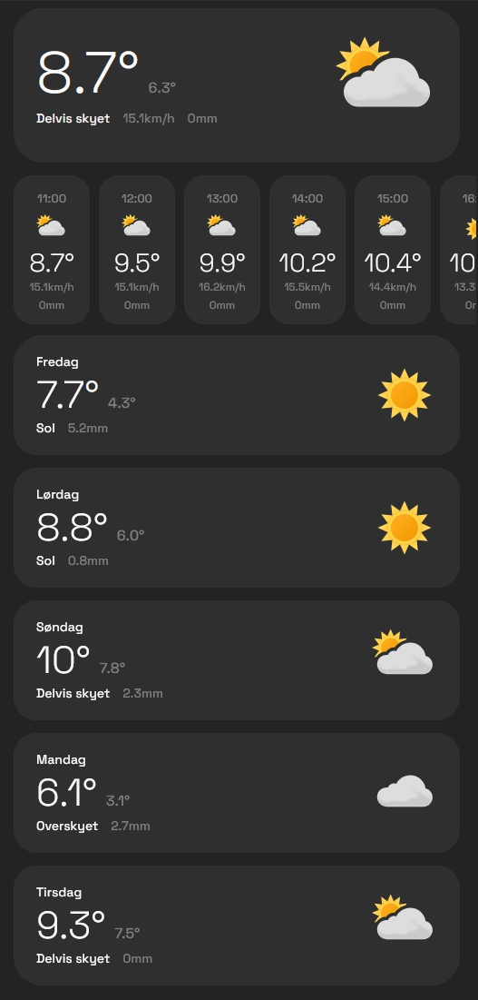

# MySmart Weather Card

A custom Home Assistant weather card for Home Assistant that loads forecast data from `weather.get_forecasts` and renders it in `hourly`, `current`, or `daily` mode.



## Support development

Buy me a coffee: https://buymeacoffee.com/mysmarthomeblog

Subscribe to Youtube channel: https://www.youtube.com/@My_Smart_Home

## Features

- **Three display modes:** `hourly`, `current`, and `daily`.
- **Scrollable hourly forecast:** Great for dashboard popups and compact weather views.
- **Localized labels:** Supports English, Norwegian, and German for conditions, weekdays, wind labels, and current-mode detail labels.
- **Optional local icon pack:** Use your own condition-based icon files via `icon_path`.
- **Popup-friendly layout hack:** Optional `hourly_width_offset` for hourly rows inside modals/popups.
- **Visual editor support:** Main options are available directly in the Home Assistant UI editor.

## Installation

### HACS (Recommended)

1. Go to the HACS page in your Home Assistant instance.
2. Click the three-dot menu in the top right.
3. Select "Custom repositories".
4. In the "Repository" field, paste the URL of this repository (`https://github.com/agoberg85/mysmart-weather-card`).
5. For "Category", select "Dashboard".
6. Click "Add".
7. The `mysmart-weather-card` repository will now appear in HACS. Click "Install".

### Manual Installation

1. Download the `mysmart-weather-card.js` file from this repository.
2. Copy it to the `www` directory in your Home Assistant `config` folder.
3. In Home Assistant, go to Settings > Dashboards, click the three dots in the top corner and go to "Resources" and add:
   - URL: `/local/mysmart-weather-card.js`
   - Resource Type: `JavaScript Module`

## Configuration

### Basic Example

```yaml
type: custom:mysmart-weather-card
entity: weather.forecast_nilsen_goberg
mode: hourly
```

### Current Mode Example

```yaml
type: custom:mysmart-weather-card
entity: weather.forecast_nilsen_goberg
mode: current
title: Været nå
show_title: true
language: "no"
background_color: var(--gray200)
icon_path: /local/weather_icons/met
```

### Daily Mode Example

```yaml
type: custom:mysmart-weather-card
entity: weather.forecast_nilsen_goberg
mode: daily
show_title: false
language: "de"
skip_first: true
background_color: var(--gray200)
icon_path: /local/weather_icons/met
```

### Main Options

| Name | Type | Required? | Description | Default |
| :--- | :--- | :--- | :--- | :--- |
| `type` | string | **Required** | Must be `custom:mysmart-weather-card`. | |
| `entity` | string | **Required** | Weather entity used for `weather.get_forecasts`. | |
| `mode` | string | Optional | `hourly`, `current`, or `daily`. | `hourly` |
| `title` | string | Optional | Card title. In `current` mode this is shown inside the card. | `''` |
| `show_title` | boolean | Optional | Show or hide the title. | `true` |
| `language` | string | Optional | Language override for translated labels. Supported: `en`, `no`, `de`. Leave empty to follow the Home Assistant frontend locale automatically. | `auto` |
| `hours_to_show` | number | Optional | Number of hourly forecast entries to display in `hourly` mode. | `24` |
| `hourly_width_offset` | number | Optional | Extra width hack for `hourly` mode, useful inside popups. | `0` |
| `skip_first` | boolean | Optional | Skip the first item in `daily` mode. | `false` |
| `background_color` | string | Optional | Background color for forecast items. | theme derived |
| `card_background` | string | Optional | Outer `ha-card` background. Mostly relevant for `hourly` mode. | theme default |
| `icon_path` | string | Optional | Base path for local condition icons. Files should be named by condition, for example `rainy.svg`. | `''` |

## Icon Files

If `icon_path` is set, the card looks for icons using the Home Assistant condition name:

- `sunny.svg`
- `cloudy.svg`
- `rainy.svg`
- `clear-night.svg`
- `partlycloudy.svg`
- etc

I recommend placing the icon files in a folder inside the www folder.
See [Home Assistant Weather Condition mapping](https://www.home-assistant.io/integrations/weather/#condition-mapping) for what filenames are required.
It first tries `.svg`, then falls back to `.png`, and finally falls back to built-in Home Assistant icons if no local file exists.

## Help with translation

If you want to help translate the card into another language, please open an issue or a pull request.

Translations now live in separate files:

- `src/locales/en.js`
- `src/locales/no.js`
- `src/locales/de.js`

Each locale file contains:

- weather condition labels
- wind strength labels
- wind direction labels
- current mode detail labels
- small UI strings

To add a new language:

1. Copy one of the existing locale files in `src/locales/`.
2. Translate the values.
3. Import the new file in `src/locales/index.js`.
4. Add the language to `LOCALES`.
5. Update `resolveLanguageKey()` if you want automatic Home Assistant locale mapping for that language.
6. Add the new option to the card editor if you want it selectable manually.

If `language` is not set in the card config, the card will automatically follow the Home Assistant frontend language when possible.
